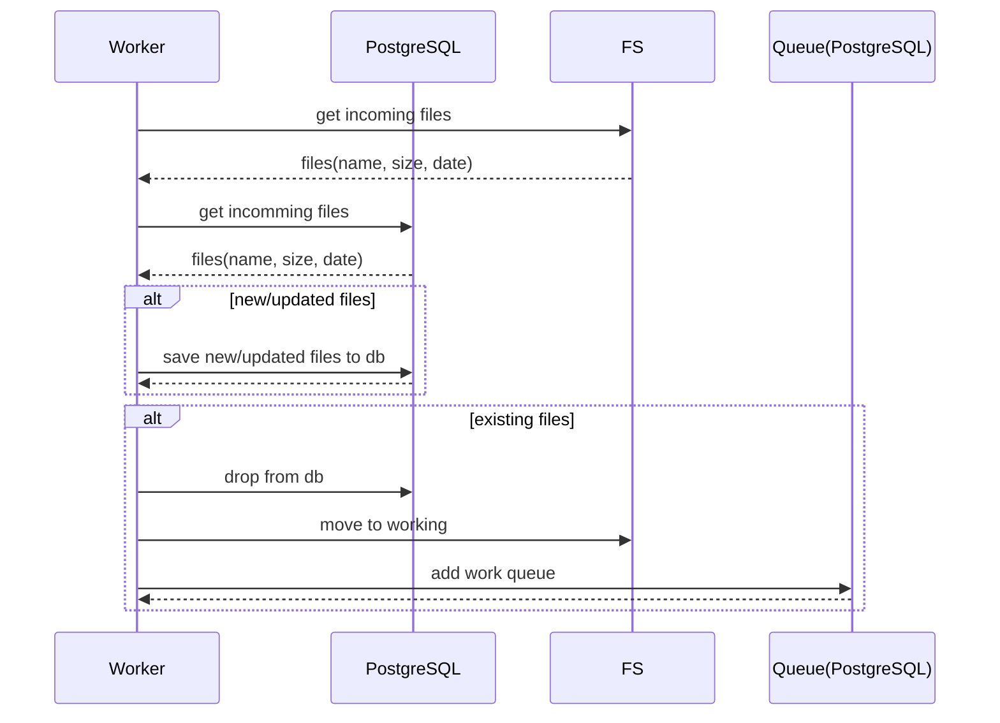
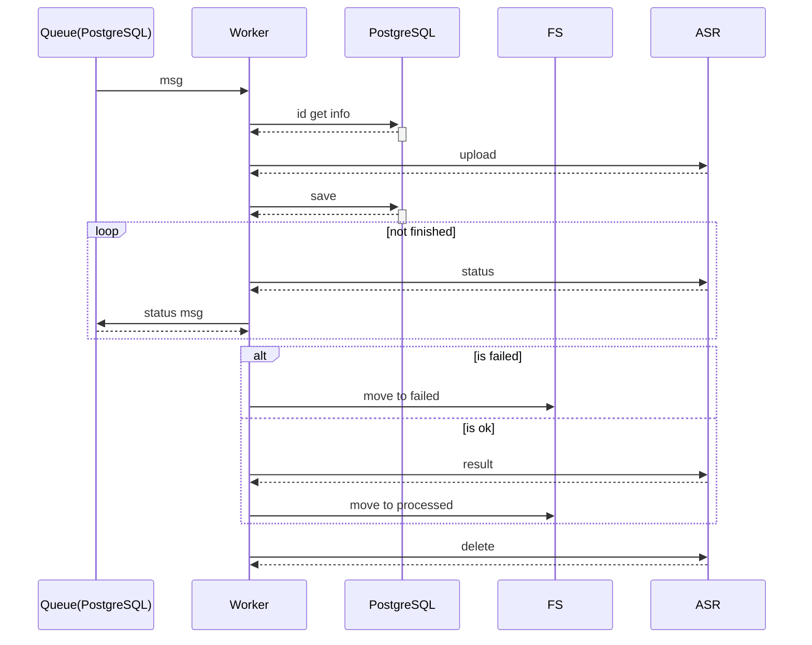
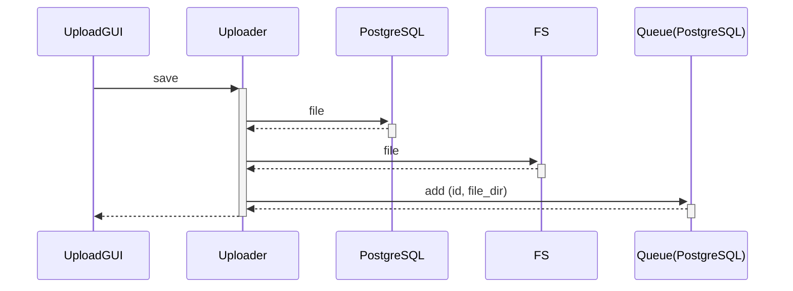
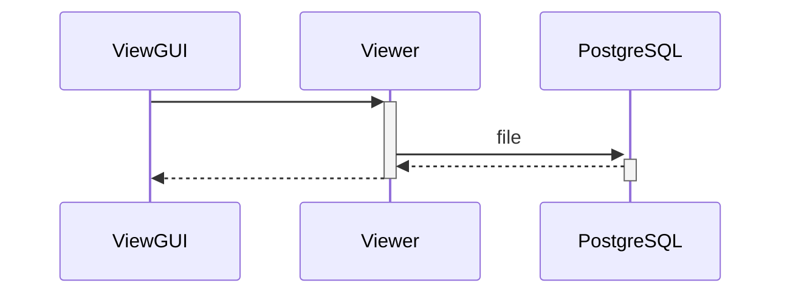
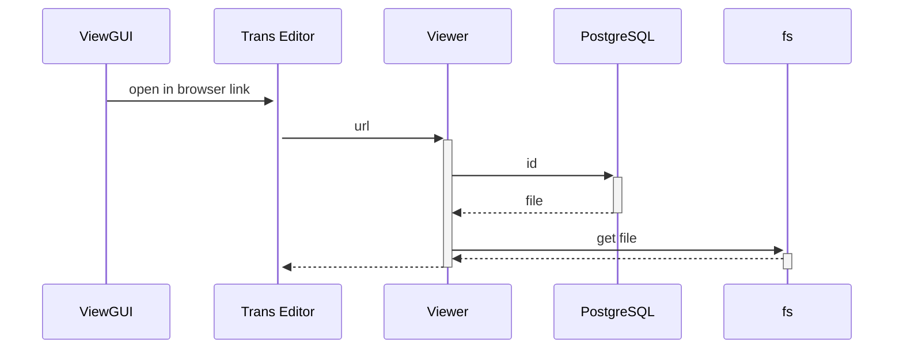

### File dir watcher

### ASR Queue Worker

### Upload

### List

### Open Transcription

### Components

1. UploadGUI
2. ViewGUI
3. Uploader
4. Viewer
5. Worker
6. DirWatcher
7. PostgreSQL
8. Queue(PostgreSQL)